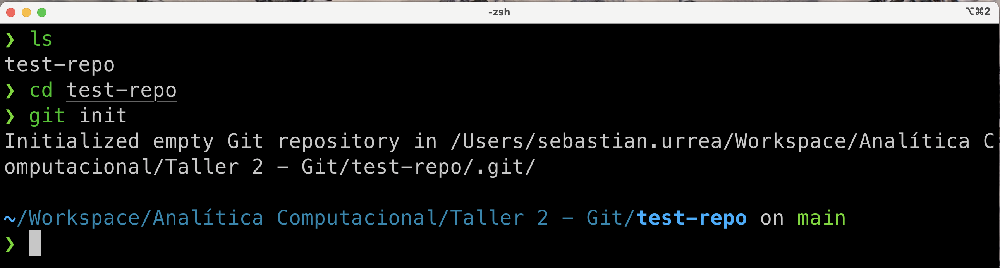
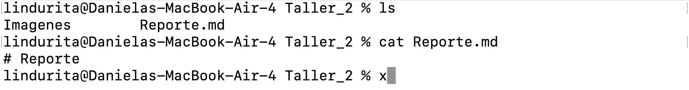
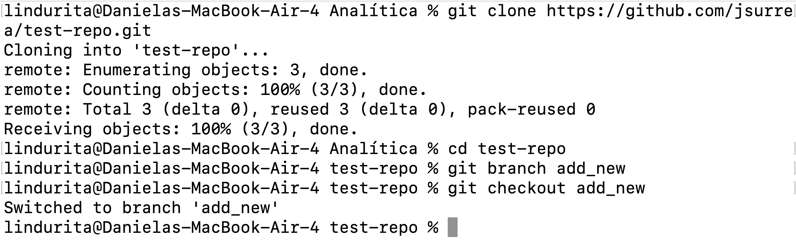
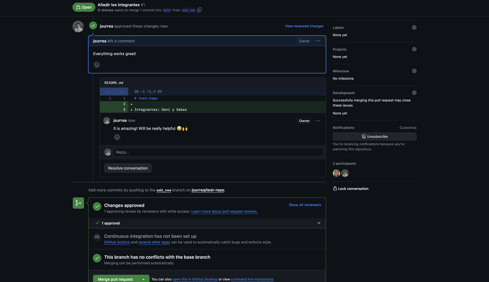

# Reporte

**Integrantes:**

- Juan Sebastián Urrea López- 201914710
- Karol Daniela Arenas Solano-202014996

#### 2.Cree un repositorio local (individualmente).

##### Dani

##### Sebas

#### 3.Cree un repositorio público en GitHub (individualmente) y enlace el repositorio local al remoto en Github.

##### Dani

##### Sebas

#### 4.Agregue algunos archivos al repositorio, haga el respectivo commit y push.

##### Dani

##### Sebas

#### 5.Verifique que sus archivos hayan quedados registrados localmente y remotamente.

##### Dani

##### Sebas

#### 6.Incluya como colaboradores a su compañero/a de grupo y al profesor (juanfperez).

##### Dani

##### Sebas

#### 7.Permita acceso restringido a través de pull requests a su rama principal (master/main).

##### Dani

##### Sebas

#### 8.Realice un cambio sobre el repositorio de su compañero/a en una rama nueva.

##### Dani

##### Sebas

#### 9.Suba la rama al repo remoto de su compañero/a y solicite un pull request.

##### Dani

##### Sebas

#### 10.Al recibir el pull request de su compañero/a, revíselo, coméntelo y acéptelo.

##### Dani

##### Sebas

#### 12.Incluya la URL de su repositorio en su reporte.

##### Dani

[https://github.com/D-Arenas/Taller2_analitica](https://github.com/D-Arenas/Taller2_analitica)

##### Sebas

[https://github.com/jsurrea/test-repo](https://github.com/jsurrea/test-repo)
